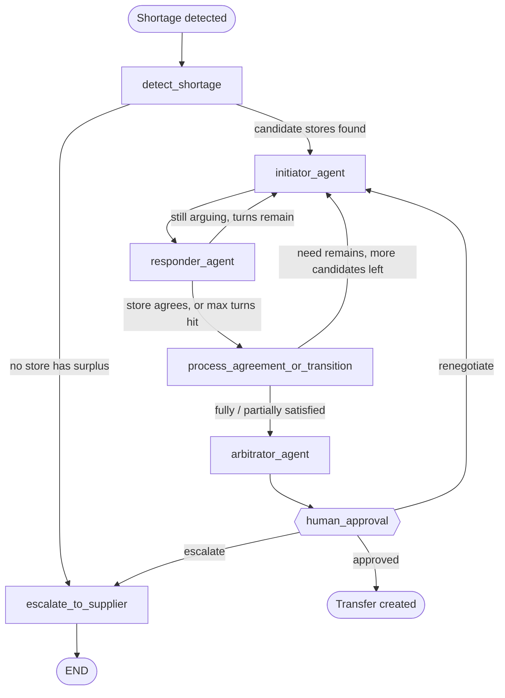

# Retail Store Agent — Multi-Store Agentic AI for Inventory Rebalancing

A multi-agent system that replaces manual, gut-feel stock reordering across a retail chain with an ML demand forecaster and a team of negotiating AI agents — one per store, plus a neutral arbitrator — that detect shortages, find surplus elsewhere in the chain, and propose a resolution automatically.

---

## The Problem

Any retail business that grows past one store hits the same wall: **stock and demand are scattered across locations, but decisions are still made one store at a time.**

Concretely, a manager today:
- Notices an item is running low *after* it's already a problem, not before.
- Has no visibility into whether a sister store two kilometers away has 40 surplus units sitting on a shelf.
- Decides how much to reorder on gut feel, not on actual sales velocity per store.
- Separately tracks expiry by memory, which means near-expiry stock either gets missed or gets counted as "available" when it shouldn't be.
- Resolves competing needs (two stores wanting the same surplus) by whoever calls first — not by any real business logic.

The result is the two-sided failure every multi-store retailer knows: **stockouts at one location and unsold, expiring surplus at another — simultaneously, in the same chain, because nobody had a system that saw both at once.**

## Who We're Solving This For

This is built for the **multi-store retail chain that's outgrown manual coordination but hasn't outgrown into enterprise territory** — regional supermarket chains, pharmacy chains, kirana/grocery chains, and small-format retail chains typically running anywhere from a handful to a few dozen outlets under one owner.

- **The chain owner** — who's currently paying for lost sales (stockouts) and dead capital (expiring surplus) at the same time, without a system that catches either automatically.
- **Store managers** — who spend time firefighting stock problems over phone calls and WhatsApp instead of running the store.
- **Customers at the counter** — who are the ones who actually experience "sorry, out of stock" when the item was sitting one store away the whole time.

This chain is deliberately not the target audience of the big enterprise ERP suites (SAP, Oracle) — those are built for chains with dedicated IT teams and long implementation timelines. It's also underserved by single-store POS/inventory apps, which stop at "here's your stock level" and don't do anything about the fact that the *chain* as a whole has the stock, just not at the right store.

## Why This Is Different

Most inventory tools — including the majority of "AI-powered" ones — do one of two things: **tell you what already happened** ("this item is low"), or **centralize data** into one dashboard and still leave the cross-store decision to a human staring at spreadsheets. Neither one solves the actual hard part: when two stores in the same chain want the same limited surplus, someone has to decide who gets it, and why.

**This system is the only one in the stack that lets the stores argue it out themselves.** Each store's agent represents that store's own interest — its urgency, its sales velocity, its context — and negotiates against other stores' agents with a neutral arbitrator settling it if they can't agree, falling back to a deterministic even split rather than stalling forever. That's a fundamentally different shape of solution from a dashboard: it's not *reporting* a shortage, it's *resolving* one, end-to-end, with the reasoning fully visible in the transcript — and a human still has to tap approve before anything physically moves.

Paired with a real forecasting model (not a static reorder-point rule) and a hard two-tier detection system (catches both the slow-building shortage *and* the sudden one-large-sale shock), the result is a chain that reacts to its *own* real-time state instead of a manager's memory of it.

---

## Overview

In a retail chain with multiple stores under one owner, stock management today looks like this: a manager notices an item is running low, calls around to other stores or a supplier, decides how much to reorder mostly on gut feel, and separately keeps an eye on expiry dates. It's slow, reactive, and depends entirely on one person's attention.

**Retail Store Agent** replaces that loop with two systems working together:

1. **A prediction engine** (XGBoost demand forecasting) that watches sales data per item per store and tells you when you're likely to run out and how much to reorder — instead of a manager guessing.
2. **A team of LangGraph-orchestrated AI agents** — one per store, plus a neutral arbitrator — that activate automatically the moment a shortage is detected. If another store in the chain has surplus of that item, the agents negotiate (each arguing its own store's case) and arrive at a decision: transfer stock from the surplus store, or escalate to the supplier if no transfer makes sense.

The manager's job shrinks to approving what the agents propose and physically confirming stock movement. Everything else — noticing the problem, deciding what to do, and justifying the decision — is handled by the system.

**What this is not:** it's not a dashboard that just flags "stock is low" and leaves the decision to a human, it's not a single-store reorder bot (the differentiator is that stores actively negotiate with each other over scarce stock), and it's not fully autonomous — every stock-moving decision still requires a human tap.

---

## Features

- **Two-tier shortage detection** — a cheap real-time check flags a sudden, unexpected drop ("immediately low") independent of the ML forecast, while a batch pipeline re-forecasts every *X* transactions and flags a slower, expected shortage ("might be low").
- **Autonomous multi-agent negotiation** — a LangGraph state machine spins up an initiator agent (the deficit store) and responder agents (candidate surplus stores, nearest-first) that argue their case turn-by-turn over a capped number of rounds.
- **Neutral arbitrator with a deterministic fallback** — if agents can't reach agreement within the turn limit, the arbitrator falls back to a strict even split of available surplus rather than stalling.
- **Automatic supplier escalation** — when no store in the org has usable surplus, or the estimated transfer time is slower than time-to-stockout, the system skips negotiation entirely and drafts a supplier order.
- **Human-in-the-loop checkpoints** — exactly four moments require a manager's tap: approve/reject a proposal, renegotiate or contact-supplier after a rejection, mark a transfer physically done (N-of-N confirmation per transfer), and send a supplier draft (WhatsApp/email deep link — no live send API).
- **Org-wide transparency** — every negotiation, including rejected, failed, or aborted ones, is logged turn-by-turn to Postgres and visible to every store in the org via a live activity feed.
- **Expiry-aware surplus** — usable surplus excludes stock nearing expiry, and a daily job flags near-expiry batches directly to the store that holds them.
- **Full inventory & config management** — CRUD screens for items, stock, suppliers, and per-org negotiation parameters (batch size, max negotiation turns).

---

## Tech Stack

| Layer | Technology |
|---|---|
| **Frontend** | Next.js 16 (App Router), React 19, TypeScript, Tailwind CSS 4, shadcn/ui on Radix primitives, TanStack Query, Zustand, Sonner |
| **Backend API** | FastAPI, SQLAlchemy 2.0, Pydantic v2 |
| **Database** | PostgreSQL |
| **Agent orchestration** | LangGraph (state machine + checkpointing), LangChain, Google Gemini (`gemini-3.5-flash-lite` via `langchain-google-genai`) |
| **Demand forecasting** | XGBoost regressor, scikit-learn (`TimeSeriesSplit` + `GridSearchCV`), pandas, NumPy, joblib |
| **Deployment target** | Render (backend, single service — API + agents + ML run in-process), Vercel (frontend) |

The negotiation engine and the FastAPI app share one process and one database session boundary by design: the ML pipeline's `service.py` and the LangGraph graph in `lang/` both import directly from `app/`, so a prediction, a triggered negotiation, and the sale that caused it commit as part of the same flow — there's no second service or queue in between.

---

## Technical Workflow

### 1. Trigger detection (real time + batch)
Every stock write (a sale or manual adjustment) runs a cheap inline check: if `qty_on_hand` drops to ≤ 20% of the item's reorder point, an **"immediately low"** negotiation is created in the same DB transaction as the write. Separately, once every `batch_x` transactions (an org-level config value) for that store/item, the batch pipeline re-runs the XGBoost forecast and checks **"might be low"** against the freshly predicted reorder point — but this batch check is skipped entirely if immediately-low already fired that cycle, so the same shortage never gets flagged twice.

### 2. Negotiation kickoff
Once a `Negotiation` row is committed, the router calls into `lang/bridge.py`, which starts the LangGraph graph for that negotiation. Every LLM turn and the final resolution are written straight to Postgres — nothing but routing state lives only in LangGraph's in-memory checkpoint.

### 3. The negotiation state machine



- **`detect_shortage`** pulls the deficit store's current stock and EOQ, then ranks every other store in the org by distance and usable surplus (surplus above what *that* store's own forecast needs, minus near-expiry stock).
- **`initiator_agent` / `responder_agent`** loop turn-by-turn: the deficit store's agent argues its case, the candidate surplus store's agent either agrees (`[AGREED]`) or refuses (`[REFUSED]`), each turn persisted as a `NegotiationTurn` row. A non-responsive agent is retried with exponential backoff + jitter; if it still doesn't respond, its last-known stock data is used without a live argument.
- **`process_agreement_or_transition`** books an agreed allocation, then either moves to the next candidate store (need still remains) or hands off to the arbitrator.
- **`arbitrator_agent`** finalizes the resolution — a full transfer, a partial fill, or (if the turn cap was hit with no agreement) a strict even split of surplus — and writes the proposed `Transfer` row(s).
- **`human_approval`** is a hard interrupt (`interrupt_before`) — the graph genuinely pauses here until a manager calls `/negotiations/{id}/approve` or `/negotiations/{id}/reject`, which resumes the graph with that decision.
- **`escalate_to_supplier`** fires when no store has usable surplus, or when the transfer would arrive slower than the store's projected stockout time (a static distance-tier → hours lookup vs. `stock ÷ daily_sales_rate`). It drafts a WhatsApp or email deep link from the store's saved supplier record — the agent never sends it; a human still has to tap Send.

### 4. Human checkpoints
There are exactly four points where the system stops and waits for a tap: infra-failure recovery (renegotiate / contact supplier / cancel), approve-or-reject a proposal, mark-transfer-done (every party to a transfer confirms individually; inventory updates atomically only once all parties have), and send-to-supplier. Nothing else in the pipeline waits on a human.

### 5. Audit trail
Every turn, every resolution, and every rejected/aborted negotiation stays queryable in Postgres and is surfaced org-wide in the frontend's activity feed — so any store manager can see what the agents decided and why, even for negotiations that weren't theirs.

---

## Setup

### Prerequisites
- Node.js 18+ and npm (or yarn/pnpm)
- Python 3.10+
- A PostgreSQL instance
- A Google Gemini API key (for `langchain-google-genai`)

### 1. Clone
```bash
git clone https://github.com/TridibeshSam31/Retail-Store-Agent.git
cd Retail-Store-Agent
```

### 2. Database
The full schema (orgs, stores, items, inventory, predictions, negotiations, transfers, suppliers, config) is documented in `understanding.md` §3 as a single ordered SQL script — run it against your Postgres instance directly (`psql`, a GUI client, etc.). *Note: `alembic` is a listed backend dependency but no migration chain is checked into the repo yet, so the schema currently has to be applied by hand from that script.*

Seed in this order, since later tables reference earlier ones:
1. `orgs`, `stores`, `items`
2. `store_distances`, `suppliers`
3. `raw_transactions` (synthetic sales history)
4. Run the prediction pipeline once to populate `daily_predictions` and `current_inventory` before testing any negotiation flow
5. One `config` row per org (`batch_x`, `max_negotiation_turns`) — negotiation logic reads this at runtime

### 3. Backend
```bash
cd backend
python -m venv venv
source venv/bin/activate        # Windows: venv\Scripts\activate
pip install -r requirements.txt
cp .env.example .env
# edit .env: set DATABASE_URL and GOOGLE_API_KEY
uvicorn app.main:app --host 0.0.0.0 --port 8000
```
Health check: `GET /health`. Data-scoped routes expect `X-Org-Id` / `X-Store-Id` headers (demo-mode identity — see `app/core/auth.py`; there's no real auth layer yet).

### 4. Frontend
```bash
cd frontend
npm install
npm run dev
```
Visit `http://localhost:3000`. Update the API base URL and the backend's CORS `allow_origins` in `backend/app/main.py` to match wherever the frontend is actually running (it's currently pinned to a single hardcoded origin).

---

## Repository Structure

```
Retail-Store-Agent/
├── understanding.md          # Full PRD + DB schema + work breakdown (source of truth)
├── backend/
│   ├── app/
│   │   ├── core/              # settings, DB session, org-scoping identity
│   │   ├── models/            # SQLAlchemy models
│   │   ├── schemas/           # Pydantic request/response schemas
│   │   ├── routers/           # inventory, negotiations, transfers, suppliers, predictions...
│   │   └── services/          # trigger detection, prediction service
│   ├── lang/                  # LangGraph negotiation engine + app/ bridge
│   ├── ml/pipeline/           # XGBoost training + in-process inference service
│   └── requirements.txt
└── frontend/
    ├── app/                    # dashboard, inventory, negotiations, predictions,
    │                           # suppliers, transfers, expiry, configuration, login
    ├── components/
    └── lib/
```

---

## Known Limitations (by design, for hackathon scope)

- No real authentication — org/store identity is set via request headers by the frontend's picker.
- Supplier contact is deep-link only (WhatsApp/email); there's no live send API.
- The reject → renegotiate loop (Case E) has no cap.
- The even-split fallback is strictly even, not proportional to each store's actual need.
- The transfer-time-vs-stockout check runs once at negotiation start, with no mid-negotiation re-check.
- Cross-org coordination is intentionally impossible — negotiation only ever happens within one chain.
